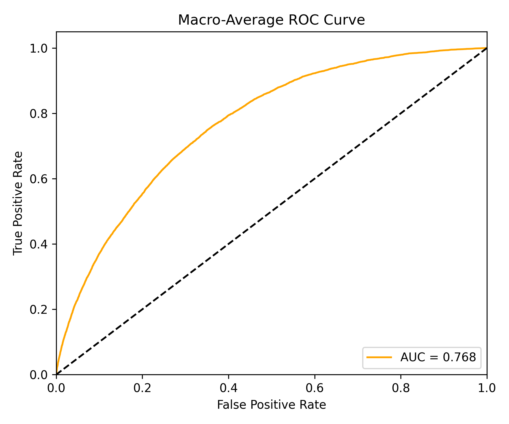
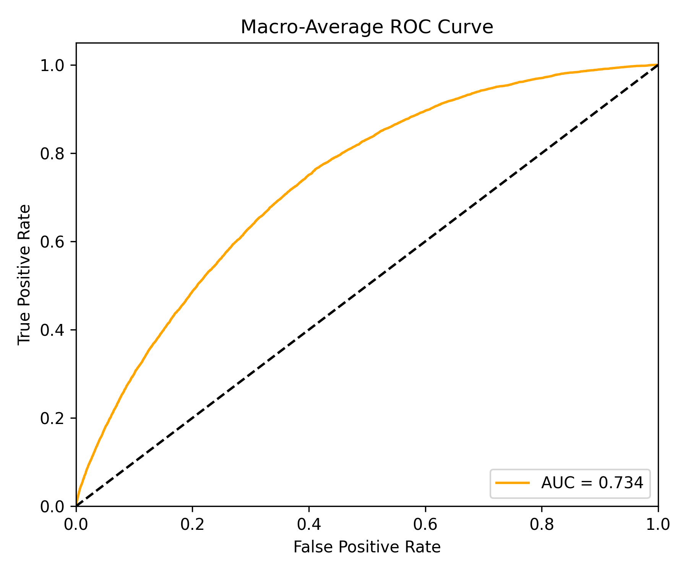
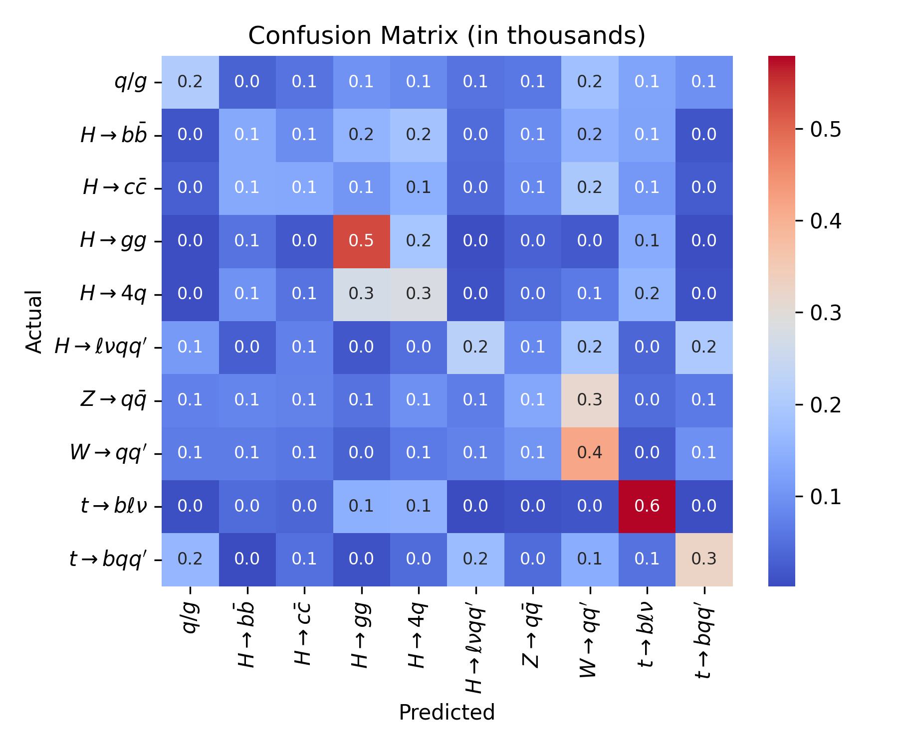
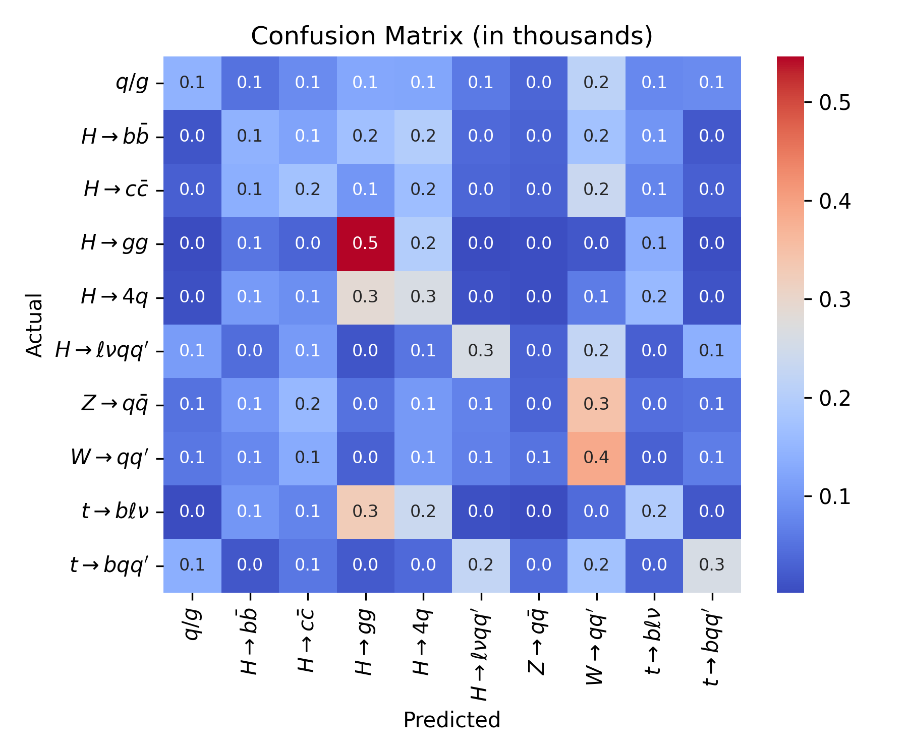
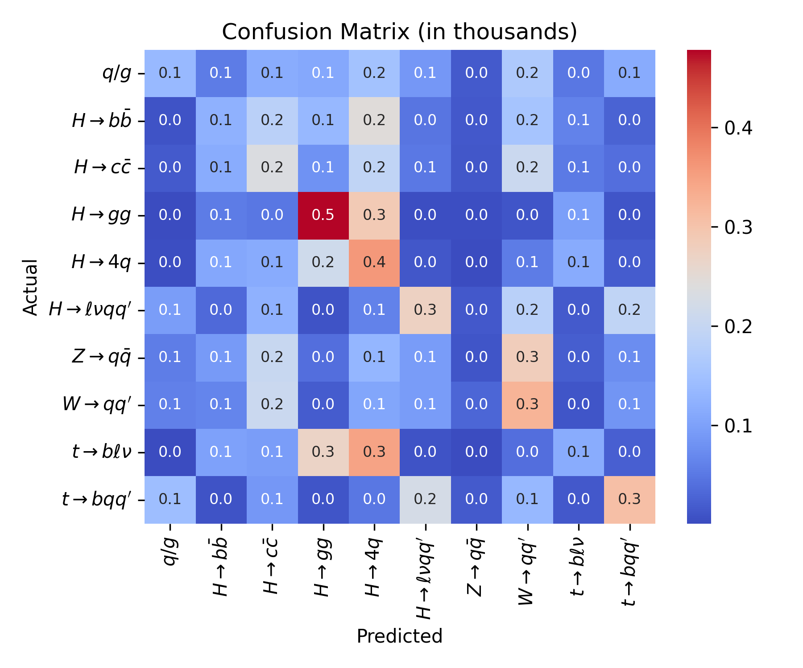

# LorentzParT-JEPA

**GSoC 2026 — Event Classification with Masked Transformer Autoencoders**

A JEPA (Joint-Embedding Predictive Architecture) pretraining pipeline for the LorentzParT model, comparing latent-space prediction against masked autoencoding (MAE) and from-scratch training on jet classification.

---

## Key Results (100k JetClass subset)

| Condition | Test Accuracy | Test Loss |
|-----------|:-------------:|:---------:|
| **JEPA pretrained → finetune** | **29.56%** | 1.868 |
| MAE pretrained → finetune | 24.06% | 1.956 |
| From scratch | 23.64% | 1.960 |

JEPA outperforms both baselines by **+5.5 pp** over MAE and **+5.9 pp** over scratch, demonstrating that learning in embedding space produces a more transferable representation than raw feature reconstruction.

> **Note:** Absolute accuracy is intentionally modest — this is a 100k proof-of-concept demo on a balanced 10-class problem (random = 10%). Full-scale results on 100M samples are expected in the 70–80% range. The relative ordering JEPA > MAE > Scratch is the key claim.

### ROC Curves

<p align="center">
  
  
  
</p>
<p align="center">
  <em>JEPA pretrained &nbsp;&nbsp;&nbsp; MAE pretrained &nbsp;&nbsp;&nbsp; From scratch</em>
</p>

---

### Confusion Matrices

<p align="center">
  
  
  
</p>
<p align="center">
  <em>JEPA pretrained &nbsp;&nbsp;&nbsp; MAE pretrained &nbsp;&nbsp;&nbsp; From scratch</em>
</p>

---

### Per-class accuracy

| Class | JEPA | MAE | Scratch |
|-------|:----:|:---:|:-------:|
| QCD / Z→νν | 20.6% | 14.3% | 13.7% |
| H→bb̄ | 13.5% | 14.4% | 12.3% |
| H→cc̄ | 13.3% | 17.3% | 23.5% |
| H→gg | 53.0% | 54.6% | 47.8% |
| H→4q | 28.1% | 26.3% | 35.9% |
| H→ℓνqq′ | 21.9% | 26.1% | 27.4% |
| Z→qq̄ | 13.2% | 3.3% | 1.2% |
| W→qq′ | 41.5% | 38.7% | 32.4% |
| t→bqq′ | **57.9%** | 19.5% | 11.5% |
| t→bℓν | 32.6% | 26.1% | 30.7% |

JEPA shows the largest gains on structurally complex decays — most notably t→bqq′ (+38 pp over MAE, +46 pp over scratch) — consistent with its objective of learning particle relationships in latent space rather than memorising feature statistics.

---

## Architecture

```
ParticleJEPA (pretraining)
├── processor        : (pT, η, φ, E) → 16-dim Lorentz multivectors + pairwise U
├── context_encoder  : LorentzParTEncoder on zeroed masked particle → (B, N, 128)
├── target_encoder   : EMA copy of context_encoder, sees full unmasked input (frozen)
└── predictor        : bottleneck transformer (64-dim < 128-dim, collapse-resistant)
      Linear(128→64) → pos embed → mask token → 4× TransformerBlock → Linear(64→128)

EMA update:  θ_target ← m·θ_target + (1−m)·θ_context,   m: 0.996 → 1.0 over training

LorentzParT (fine-tuning / from scratch)
├── encoder  : LorentzParTEncoder (weights loaded from context_encoder)
└── head     : learnable CLS token → 2× ClassAttentionBlock → Linear(128→10)
```

---

## Dataset

JetClass 100k balanced subset extracted from the 5M validation set:

| Split | Jets | Source |
|-------|-----:|--------|
| Train | 80,000 | 8,000 per class |
| Val | 10,000 | 1,000 per class |
| Test | 10,000 | 1,000 per class |

---

## Reproducing the Experiments

### 1 — Clone and install

```bash
git clone https://github.com/<your-username>/LorentzParT-JEPA.git
cd LorentzParT-JEPA

python -m venv .venv
source .venv/bin/activate

pip install -r requirements.txt
```

### 2 — Download the dataset

Download the JetClass val_5M split (~7.6 GB) from Zenodo and extract it:

```bash
wget -P /path/to/val_5M \
  "https://zenodo.org/records/6619768/files/JetClass_Pythia_val_5M.tar?download=1"

tar -xf /path/to/val_5M/JetClass_Pythia_val_5M.tar -C /path/to/val_5M/
```

### 3 — Diagnostic dry run

Before committing GPU time, verify the full pipeline wires up correctly on your environment:

```bash
python scripts/dry_run.py
# Expected: 30/30 checks passed
```

### 4 — Prepare 100k subset

```bash
python scripts/prepare_data.py \
    --data-dir /path/to/val_5M \
    --output-dir ./data \
    --seed 42
```

Output: `./data/{train,val,test}/{particles.npy, labels.npy}`

### 5 — Run all 3 experiments

```bash
python scripts/run_comparison.py --data-dir ./data --seed 42 | tee run_log.txt
```

This runs sequentially:
1. JEPA pretraining (20 epochs)
2. MAE pretraining (20 epochs)
3. Fine-tune JEPA pretrained
4. Fine-tune MAE pretrained
5. Fine-tune from scratch
6. Evaluate all 3 on test set → plots saved to `./outputs/`

---

## Outputs

```
outputs/
├── pretrain_convergence_comparison.png   # val loss vs epoch + wall-clock time
├── jepa_finetune_roc_curve.png
├── jepa_finetune_confusion_matrix.png
├── mae_finetune_roc_curve.png
├── mae_finetune_confusion_matrix.png
├── scratch_roc_curve.png
└── scratch_confusion_matrix.png
```

---

## File Structure

```
LorentzParT_JEPA/
├── configs/
│   ├── pretrain_jepa.yaml
│   ├── pretrain_mae.yaml
│   ├── finetune.yaml
│   └── evaluate.yaml
├── scripts/
│   ├── prepare_data.py      # extract 100k subset from ROOT files
│   ├── dry_run.py           # diagnostic — 30 checks, no GPU needed
│   ├── pretrain_jepa.py
│   ├── pretrain_mae.py
│   ├── finetune.py
│   ├── evaluate.py
│   └── run_comparison.py    # orchestrates all experiments end-to-end
└── src/
    ├── models/
    │   ├── jepa.py           # ParticleJEPA (NEW)
    │   ├── predictor.py      # bottleneck predictor (NEW)
    │   ├── lorentz_part.py
    │   └── ...
    ├── engine/
    │   ├── jepa_trainer.py   # JEPATrainer with EMA + timing (NEW)
    │   ├── mm_trainer.py     # MAE trainer with timing
    │   └── ...
    └── loss/
        ├── embedding_loss.py # LayerNorm-MSE JEPA loss (NEW)
        └── ...
```

---

## References

1. Qu et al. "Particle Transformer for Jet Tagging." *ICML 2022*
2. Spinner et al. "Lorentz-Equivariant Geometric Algebra Transformers for High-Energy Physics." *NeurIPS 2024*
3. Assran et al. "Self-Supervised Learning from Images with a Joint-Embedding Predictive Architecture." *CVPR 2023*
4. Nguyen, T.P. "GSoC 2025: LorentzParT Hybrid Model." *Medium 2025*
